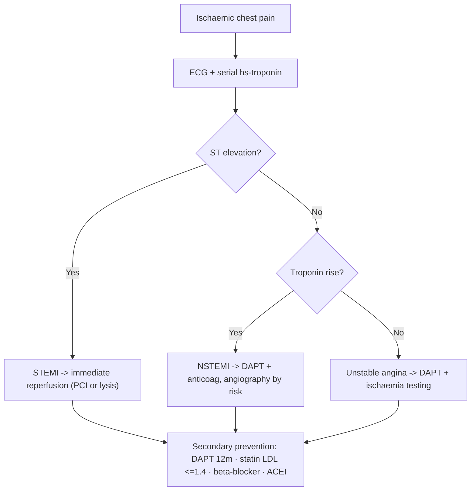

# Acute Coronary Syndromes

Acute coronary syndrome (ACS) is the acute presentation of coronary atherothrombosis — plaque rupture/erosion with superimposed thrombus causing abrupt worsening of myocardial ischaemia. It spans **unstable angina (UA)**, **NSTEMI**, and **STEMI**, and is the unstable end of the [[Ischaemic Heart Disease and Angina Pectoris]] spectrum.

## Key Concepts

### Spectrum & pathophysiology
- Atherothrombosis = atherosclerosis + acute thrombus. Mechanisms in NSTE-ACS: **non-occlusive thrombus** on a plaque, dynamic obstruction (spasm), progressive mechanical obstruction, secondary (increased demand), inflammation/infection.
- **STEMI** — fully occlusive thrombus → transmural ischaemia → ST elevation.
- **NSTE-ACS** — partial/intermittent occlusion. Splits into **NSTEMI** (troponin rises) vs **UA** (no troponin rise).

### Presentation
- Chest pain like angina but **at rest / prolonged (>20 min)**, new-onset severe (CCS III), or a *crescendo* pattern (more frequent, longer, lower threshold). Post-MI angina also counts.
- ± dyspnoea, diaphoresis, nausea, syncope. Elderly/diabetics/women may present atypically.
- **Differentials of ACS chest pain**: aortic dissection ([[Sudden Severe Chest Pain and Aortic Dissection]]), PE, pericarditis/myocarditis, pneumothorax, oesophageal/GI, musculoskeletal.

### Diagnosis
- **ECG** (repeat serially): ST elevation → STEMI pathway; ST depression, T-wave inversion, or transient changes → NSTE-ACS; may be normal. New LBBB with ischaemic symptoms is treated as STEMI-equivalent.
  - *Wellens' syndrome*: biphasic/deep T-wave inversion in V2–V4 with minimal enzyme rise = critical proximal **LAD** stenosis, high risk of anterior MI.
- **High-sensitivity troponin (hs-Tn)**: serial (0/1h or 0/2h algorithm). A rise-and-fall confirms myocardial injury (NSTEMI). Troponin is *sensitive but not specific* — raised also in renal failure, myocarditis, PE, heart failure, sepsis, arrhythmia, post-PCI/ablation/cardioversion.
- **Imaging**: echo for wall-motion/LVEF and complications; CT coronary angiography can exclude CAD in selected low-risk patients. See [[Cardiovascular Investigations and ECG]].

### Risk stratification
- Higher risk: ongoing rest pain >20 min, dynamic ST changes, raised troponin, haemodynamic instability, heart failure signs (S3, new MR, pulmonary oedema), arrhythmia, age, prior MI/PAD/CABG. Formal scores (e.g. GRACE) guide timing of angiography.

### Management of NSTE-ACS
- **Anti-ischaemic / general**: oxygen only if SpO₂ <90%, GTN (caution SBP <90), morphine for refractory pain, β-blocker (or non-DHP CCB if β-blocker contraindicated and no heart failure), atropine for vagal bradycardia. Bed rest with continuous ECG/BP monitoring.
- **Dual antiplatelet therapy (DAPT)**: aspirin (loading 150–300 mg then 75–100 mg daily) **plus** a P2Y12 inhibitor (ticagrelor or prasugrel preferred; clopidogrel if others unsuitable). See [[Antiplatelets and Anticoagulation]].
- **Anticoagulation**: LMWH (enoxaparin), fondaparinux, UFH, or bivalirudin.
- **Strategy**: routine **invasive** (coronary angiography ± PCI/CABG) vs selective/conservative, timed by risk. High-risk → early invasive.
- Add **PPI** for GI protection, high-intensity **statin** early.

### Worked example (from lecture case)
- M/51, rest chest pain, known CAD who defaulted meds; ECG biphasic T inversion/ST depression V1–V6, hs-TnT elevated → **NSTEMI**. Treated with aspirin + enoxaparin + ticagrelor + PPI + rosuvastatin, echo LVEF 40%, then coronary angiography with PCI/stent to LAD.

### Secondary prevention (after ACS)
- **Antiplatelet**: lifelong aspirin 75–100 mg; add P2Y12 inhibitor (DAPT) for ~12 months (individualise for bleeding risk).
- **Anti-ischaemic/prognostic**: β-blocker; **ACEI** (or ARB) if heart failure, LVEF ≤40%, hypertension, or diabetes.
- **Statin** to LDL-C ≤1.4 mmol/L.
- **Risk factors**: smoking cessation, BP control ([[Hypertension]]), glycaemic control (HbA1c ~7%), diet/weight, cardiac rehabilitation.

## Approach

## Practice Questions

> [!question]- Q1: How do UA, NSTEMI, and STEMI differ?
> All share plaque rupture/thrombus. **STEMI** = occlusive thrombus with ST elevation. **NSTE-ACS** = partial occlusion without ST elevation; if troponin rises it is **NSTEMI**, if not it is **unstable angina**.

> [!question]- Q2: A patient has deep biphasic T-wave inversions in V2–V4 with near-normal troponin. What is the concern?
> **Wellens' syndrome** — critical proximal LAD stenosis with high risk of imminent anterior MI. Needs urgent coronary angiography; avoid stress testing.

> [!question]- Q3: List four non-ACS causes of a raised troponin.
> Renal failure, myocarditis, pulmonary embolism, acute/chronic heart failure (also sepsis, arrhythmia, post-PCI/ablation/cardioversion). Troponin is sensitive but not specific.

> [!question]- Q4: What is the antithrombotic regimen for NSTEMI?
> Aspirin (loading then maintenance) + a P2Y12 inhibitor (ticagrelor/prasugrel preferred) = DAPT, **plus** parenteral anticoagulation (enoxaparin, fondaparinux, UFH, or bivalirudin).

> [!question]- Q5: When is oxygen indicated in ACS, and why not routinely?
> Only if SpO₂ <90% (or respiratory distress). Routine oxygen in normoxaemic patients confers no benefit and may cause coronary vasoconstriction/harm.

> [!question]- Q6: What are the five pillars of secondary prevention after ACS?
> Antiplatelet (aspirin ± P2Y12 for ~12 months), high-intensity statin (LDL ≤1.4), β-blocker, ACEI/ARB (esp. LVEF ≤40%/HTN/DM), and risk-factor modification with cardiac rehabilitation.

> [!question]- Q7: Which acute ECG finding mandates immediate reperfusion rather than the NSTE-ACS pathway?
> Persistent ST-segment elevation (or new LBBB with ischaemic symptoms) = STEMI-equivalent → primary PCI/fibrinolysis, not the risk-stratified NSTE-ACS approach.
