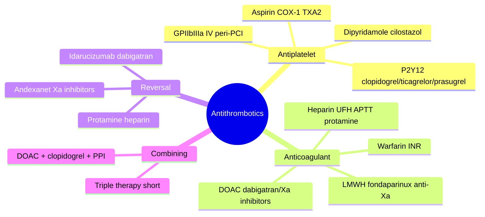

# Antiplatelets and Anticoagulation

Antithrombotic drugs prevent and treat thrombosis. **Antiplatelets** target *arterial* (platelet-rich) thrombosis (ACS, stroke, PCI); **anticoagulants** target *venous/cardioembolic* (fibrin-rich) thrombosis (VTE, AF stroke prevention). Both reduce thrombotic events at the cost of **bleeding**, so choice and duration are individualised. Underpins management in [[Acute Coronary Syndromes]], [[Sudden Severe Chest Pain and Aortic Dissection]], and [[Syncope and Arrhythmia]] (AF).

## Key Concepts

### Aspirin
- **Mechanism**: irreversibly acetylates platelet **COX-1 (Ser-529)** → blocks **thromboxane A₂** synthesis. Platelets cannot resynthesise the enzyme, so effect lasts the platelet lifespan (~7–10 days); low daily doses give near-complete (97–100%), cumulative inhibition.
- **Interaction**: ibuprofen/naproxen compete at the COX docking site and can **blunt aspirin's antiplatelet effect**.
- **Doses**: 75–150 mg/day antiplatelet; 300 mg loading in acute MI; higher for analgesia/anti-inflammatory (e.g. Kawasaki).
- **Adverse**: GI irritation/bleeding, allergy (rhinitis/asthma/urticaria), **salicylism** (tinnitus, deafness, confusion) in overdose (respiratory alkalosis then metabolic acidosis), **Reye's syndrome** (avoid in children <15 with viral illness), avoid in gout.

### P2Y12 (ADP-receptor) inhibitors
- **Clopidogrel, prasugrel** = thienopyridine **prodrugs** → irreversible receptor block. **Ticagrelor** = direct, reversible, allosteric antagonist (not a prodrug).
- **Clopidogrel** needs hepatic **CYP2C19** activation → **poor metabolisers** get less effect (boxed warning; genotype-guided alternatives). Interacts with **omeprazole/esomeprazole** (CYP2C19 inhibition) — prefer pantoprazole if a PPI is needed.
- **Ticagrelor/prasugrel** act faster and more completely, giving greater event reduction than clopidogrel in ACS; ticagrelor is reversible (recovery 3–4 days), unaffected by CYP2C19, but interacts with strong CYP3A4 inhibitors/inducers and digoxin (P-gp).
- Combined with aspirin = **dual antiplatelet therapy (DAPT)** — the pathways (TXA₂, ADP, thrombin) are non-redundant, so effects are additive.

### GPIIb/IIIa inhibitors
- **Abciximab, eptifibatide, tirofiban** — IV, block fibrinogen binding at the final common pathway of aggregation. Short half-life (infusion), used peri-PCI in high-risk cases.

### Other antiplatelets
- **Dipyridamole, cilostazol**: phosphodiesterase inhibitors (↑cAMP/cGMP), vasodilator + antiplatelet. Aspirin + extended-release dipyridamole for secondary stroke prevention (headache limits use).

### Heparins
- **Unfractionated heparin (UFH)**: potentiates **antithrombin III** to inactivate thrombin (IIa), Xa, IXa; IV, immediate onset, **monitor APTT**, reversed by **protamine**. Variable response; does not lyse existing clot; risk of HIT.
- **LMWH (enoxaparin)**: more predictable, subcutaneous, mainly anti-**Xa**, less monitoring — used for ACS, VTE treatment/prophylaxis.
- **Fondaparinux**: synthetic pentasaccharide, selective anti-Xa.

### Direct oral anticoagulants (DOACs)
- **Dabigatran** (direct thrombin/IIa inhibitor); **rivaroxaban, apixaban, edoxaban** (direct **factor Xa** inhibitors).
- Preferred over warfarin for **non-valvular AF** and VTE (predictable dosing, fewer interactions, no routine monitoring). Dose adjust for renal function.
- **Not suitable**: mechanical heart valves, thrombotic antiphospholipid syndrome, AF with moderate–severe rheumatic mitral stenosis (use **warfarin**).
- **Reversal**: **idarucizumab** for dabigatran; **andexanet alfa** for factor Xa inhibitors.

### Warfarin
- Vitamin-K antagonist; monitor **INR**; many food/drug interactions; efficacy tracked by **time in therapeutic range (TTR)**. Still first-line where DOACs are contraindicated.

### Combining anticoagulant + antiplatelet (AF + PCI/ACS)
- "**Triple therapy**" (anticoagulant + DAPT) maximises bleeding risk — keep it **short (≤30 days)**; when combined with anticoagulation, **clopidogrel** is the preferred antiplatelet and aspirin is limited to <100 mg.
- Typical: DOAC + P2Y12 inhibitor for 6–12 months, then **anticoagulation monotherapy** after 12 months. Add a **PPI** for GI protection when ≥2 antithrombotics are used.

## Mind Map

## Practice Questions

> [!question]- Q1: Why does a single low daily dose of aspirin give a lasting antiplatelet effect?
> Aspirin **irreversibly** acetylates platelet COX-1; platelets have no nucleus and cannot resynthesise the enzyme, so thromboxane A₂ production only recovers as new platelets enter the circulation (~10%/day) — a continuous effect from low, cumulative dosing.

> [!question]- Q2: How does clopidogrel differ pharmacologically from ticagrelor?
> Clopidogrel is a **prodrug** requiring hepatic CYP2C19 activation and binds the P2Y12 receptor **irreversibly**; CYP2C19 poor metabolisers respond poorly. Ticagrelor is **direct-acting** (no activation), a **reversible** allosteric antagonist, faster and more potent, unaffected by CYP2C19.

> [!question]- Q3: Which PPI is preferred alongside clopidogrel and why?
> **Pantoprazole** (or rabeprazole). Omeprazole/esomeprazole strongly inhibit CYP2C19, reducing clopidogrel's activation and antiplatelet effect. (No such interaction with ticagrelor.)

> [!question]- Q4: Give the reversal agents for dabigatran and for the factor Xa inhibitors.
> **Idarucizumab** reverses dabigatran; **andexanet alfa** reverses rivaroxaban/apixaban (and other factor Xa inhibitors). Protamine reverses heparin.

> [!question]- Q5: In which conditions is warfarin required rather than a DOAC?
> Mechanical heart valves, thrombotic antiphospholipid syndrome, and AF with moderate–severe rheumatic mitral stenosis — DOACs are not adequately effective/safe in these settings.

> [!question]- Q6: What are the principles of "triple therapy" after PCI in a patient with AF?
> Anticoagulant + aspirin + P2Y12 maximises bleeding risk, so keep the triple phase short (≤30 days), use clopidogrel as the P2Y12 agent, limit aspirin to <100 mg, add a PPI, then step down to DOAC + P2Y12 for up to 12 months and anticoagulation alone thereafter.

> [!question]- Q7: Contrast the monitoring and antidote of unfractionated heparin with LMWH.
> UFH is monitored by **APTT** and reversed by **protamine** (fully); LMWH has predictable anti-Xa activity needing little monitoring, and protamine only partially reverses it. Both act via antithrombin III.
