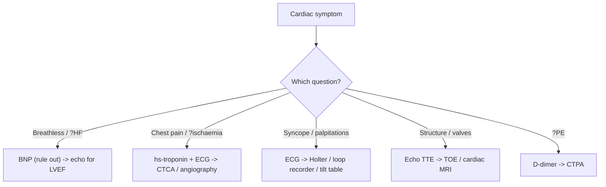

# Cardiovascular Investigations and ECG

Cardiovascular investigations exist to **confirm the diagnosis, delineate the cause, assess severity/complications, and guide management** — chosen from the differential generated by history and examination, not ordered blindly. In an emergency, do not wait for investigations to treat.

## Key Concepts

### Blood tests / biomarkers
- **FBC, U&E (Na/K/Ca/PO₄), glucose, ABG, CRP/procalcitonin, TSH/free T4, urinalysis** as baseline.
- **Natriuretic peptides (BNP / NT-proBNP)**: released from ventricular myocytes in response to **wall stretch**. A **low** value has high negative predictive value to **rule out heart failure**; raised values are non-specific (AF, renal failure, PE, sepsis) and **falsely low in obesity**. Central to [[Heart Failure]].
- **High-sensitivity troponin (hs-cTn)**: specific marker of myocardial *injury* (not a mechanism). Serial **0/1h or 0/2h** algorithm (absolute value + delta) for suspected ACS. Elevated in many non-ACS states (renal failure, myocarditis, PE, HF, sepsis); rare false positives (heterophilic antibodies, severe skeletal muscle disease). See [[Acute Coronary Syndromes]].
- **D-dimer**: fibrin degradation product; sensitive (≥95%) but not specific for PE — used to **rule out** in low/intermediate probability. Cut-off 500 µg/L; **age-adjusted (age×10)** if >50 y. Raised in cancer, infection, pregnancy, hospitalisation.

### ECG
- Records the heart's electrical activity; the **initial test for all potential cardiac conditions**. Read systematically: rate, rhythm, axis, intervals (PR, QRS, QTc), voltage, waveforms.
- **Lead localisation**: II/III/aVF = inferior; V1–V2 = septum/RV; V3–V4 = anterior/apex; V5–V6, I, aVL = lateral.
- **Disease patterns**:
  - CAD: regional ST elevation (convex), ST depression, T inversion, Q waves, LBBB, ventricular ectopy (see [[Sudden Severe Chest Pain and Aortic Dissection]]).
  - Cardiomyopathy: LVH, low voltage, poor R progression, BBB, AF (see [[Inherited Cardiac Conditions]]).
  - Pericarditis: widespread **concave** ST elevation with PR depression.
  - PE: sinus tachycardia, **S1Q3T3**, RBBB, right axis, anterior T inversion.
  - Channelopathies: long QTc, Brugada pattern, WPW delta wave.

### Chest X-ray
- Heart failure signs: cardiomegaly (**cardiothoracic ratio >0.5**), upper-lobe venous diversion, **Kerley B lines**, peribronchial cuffing, bat-wing oedema, pleural effusions.
- **Widened mediastinum** → aortic aneurysm/dissection (a dissection with a left pleural effusion is Type A until proven otherwise).
- Mitral stenosis: left atrial enlargement (double density, splayed carina, straight left heart border).

### Echocardiography
- **Transthoracic (TTE)**: LV/RV size & function (LVEF), wall motion, diastolic function, valves, chamber sizes, shunts (ASD/VSD), pericardial effusion, aortic root. First-line, non-invasive.
- **Transoesophageal (TOE)**: better for **vegetations/endocarditis**, left atrial appendage clot (pre-cardioversion), aortic dissection in unstable patients, prosthetic valves, and to guide procedures. Weigh sedation/aspiration/perforation risks.

### Ambulatory & functional testing
- **Holter / event recorder / implantable loop recorder** for symptom–rhythm correlation (palpitations, syncope) and prognostication (see [[Syncope and Arrhythmia]]).
- **Exercise ECG**: limited sensitivity/specificity for CAD; useful to validate exertional symptoms and provoke arrhythmia.
- **Tilt-table test**: differentiates reflex (vasovagal) syncope from orthostatic hypotension; positive only if symptoms reproduced.

### Advanced imaging & invasive
- **Cardiac MRI**: gold standard for volumes/function; tissue characterisation — oedema (T2), scar (late gadolinium enhancement), infiltration; stress perfusion for ischaemia.
- **CT coronary angiography** and **stress nuclear (SPECT/PET)** perfusion for CAD assessment.
- **Cardiac catheterisation**: coronary angiography, direct chamber pressures, cardiac output, **gold standard for pulmonary hypertension** and shunt quantification (Qp/Qs).
- **Endomyocardial biopsy** (myocarditis/infiltration — only if it changes treatment); **genetic testing** for heritable disease.

## Approach

## Practice Questions

> [!question]- Q1: What is the main clinical value of a BNP/NT-proBNP measurement in breathlessness?
> Its high **negative predictive value**: a low level effectively rules out heart failure as the cause. Elevated values are supportive but non-specific, and BNP is falsely low in obesity.

> [!question]- Q2: How does the ECG lead layout localise myocardial territory?
> II, III, aVF = inferior; V1–V2 = septum/RV; V3–V4 = anterior/apex; V5–V6, I, aVL = lateral. This maps ST/Q-wave changes to the culprit coronary territory.

> [!question]- Q3: Distinguish the ST-elevation of pericarditis from that of STEMI.
> Pericarditis: **widespread, concave ("saddle") ST elevation with PR depression**, not fitting a coronary territory. STEMI: **regional, convex ST elevation** in contiguous leads with reciprocal changes.

> [!question]- Q4: When is transoesophageal echo preferred over transthoracic?
> For infective endocarditis vegetations, left atrial appendage thrombus before cardioversion, aortic dissection in unstable patients, prosthetic valve assessment, and procedural guidance — situations where TTE resolution is inadequate.

> [!question]- Q5: Give the ECG signs classically associated with pulmonary embolism.
> Sinus tachycardia (commonest), **S1Q3T3**, right bundle branch block, right axis deviation, and anterior (V1–V4) T-wave inversion.

> [!question]- Q6: What is the age-adjusted D-dimer cut-off and why use it?
> For patients >50 years, cut-off = age × 10 µg/L (vs standard 500 µg/L). It improves specificity in older patients (who have higher baseline D-dimer) while preserving the ability to rule out PE.

> [!question]- Q7: Which investigation is the gold standard for diagnosing pulmonary hypertension?
> **Right-heart cardiac catheterisation** with direct measurement of pulmonary artery pressures (and pulmonary vascular resistance).
