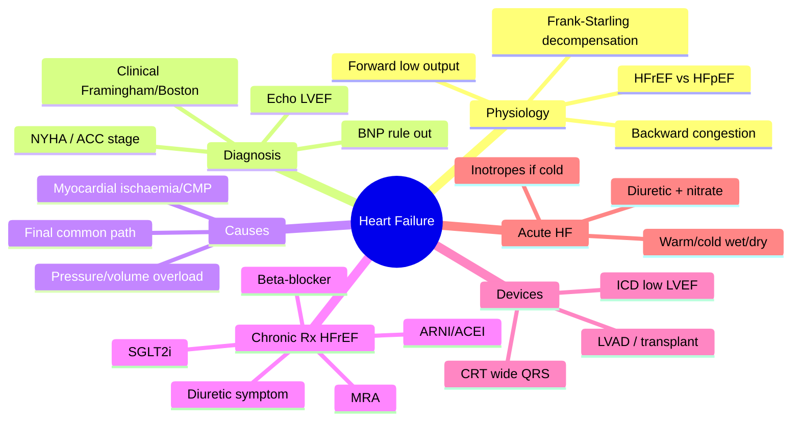

# Heart Failure

Heart failure (HF) is a **clinical syndrome** in which the heart cannot pump blood at a rate meeting the metabolic demands of tissues *despite adequate filling pressures* (forward failure/hypoperfusion), and/or can only do so from **elevated filling pressures** (backward failure/congestion). It is the final common pathway of nearly all cardiac disease. Breathlessness on exertion is the presenting symptom but is non-specific — the diagnosis is clinical, supported by [[Cardiovascular Investigations and ECG|BNP, ECG, CXR and echo]].

## Key Concepts

### Physiology & classification of dysfunction
- **Forward failure** → low output (dizziness, confusion, cold clammy peripheries, hypotension, oliguria; extreme = cardiogenic shock).
- **Backward failure** → congestion. **Left HF** → pulmonary congestion (exertional dyspnoea, orthopnoea, PND, nocturnal cough, pink frothy sputum, basal crepitations, S3). **Right HF** → systemic congestion (raised JVP, hepatomegaly, ankle/sacral pitting oedema, ascites).
- **Frank-Starling in HF**: on the ascending limb, ↑preload ↑stroke volume; past the optimal point the failing ventricle *decompensates* so extra preload only raises filling pressure → congestion. Explains **orthopnoea/PND** (lying flat returns 300–600 mL pooled venous blood).
- **Pulmonary oedema** occurs when LV end-diastolic pressure raises pulmonary capillary hydrostatic pressure above plasma oncotic pressure (~28 mmHg), forcing fluid into interstitium/alveoli.

### HFrEF vs HFpEF
- **HFrEF** (LVEF ≤40%, "systolic"): dilated LV, often younger/male, prior MI, S3. Prognosis-modifying drug therapies are proven here.
- **HFpEF** (LVEF ≥50%, "diastolic"): stiff, often LVH, elderly/female, hypertension/DM/obesity, S4; diagnosis is partly one of excluding non-cardiac dyspnoea.
- **HFmrEF** (41–49%) intermediate.

### Diagnosis (clinical + tests)
- **Clinical scoring**: Framingham and Boston criteria (major/minor symptoms, signs, CXR).
- **BNP / NT-proBNP**: released on ventricular wall stretch; **low value rules HF out** (high NPV). Raised also in AF, ACS, renal failure, PE, sepsis, age; **falsely low in obesity**.
- **ECG** (LVH, arrhythmia, prior MI), **CXR** (cardiomegaly CTR >0.5, upper-lobe diversion, Kerley B lines at LA pressure 15–20 mmHg, bat-wing oedema >25 mmHg, effusions), **echocardiogram** (LVEF, chamber size, valves, diastolic function — the key structural test), bloods (FBC, U&E, TFT, glucose).
- **Killip class** stratifies LV dysfunction severity post-MI (I → IV = cardiogenic shock).

### Causes
- HF is the final common path of all cardiac disease: pressure overload ([[Hypertension]], pulmonary HT, aortic/pulmonary stenosis), volume overload (valve regurgitation, shunts), **myocardial disease** (ischaemia — see [[Ischaemic Heart Disease and Angina Pectoris]]; [[Inherited Cardiac Conditions|cardiomyopathies]]; toxins/alcohol/anthracyclines; myocarditis; infiltration), arrhythmia ([[Syncope and Arrhythmia]]), and pericardial/constrictive disease.

### Staging
- **NYHA functional class I–IV** (symptom-based, reversible).
- **ACC/AHA stage A–D** (structural, progressive: A = at risk; B = structural disease, no symptoms; C = symptomatic; D = refractory).

### Neurohormonal model
- ↓cardiac output activates the **RAAS** and **sympathetic** systems → vasoconstriction, Na/water retention, fibrosis and hypertrophy (**remodelling**). Initially adaptive, chronically maladaptive → a **vicious cycle**. The natriuretic peptide system opposes this. Modern therapy **blocks the maladaptive neurohormones**.

### Chronic HFrEF treatment — the "four pillars" (prognostic)
1. **ARNI (sacubitril-valsartan)** or **ACEI** (ARB if ACEI-intolerant — cough/angioedema). ARNI superior to enalapril (PARADIGM-HF).
2. **β-blocker** (bisoprolol, carvedilol, metoprolol-CR) — start low, titrate slowly; ↓mortality (CIBIS-II, MERIT-HF, COPERNICUS).
3. **Mineralocorticoid receptor antagonist (MRA)** — spironolactone/eplerenone; monitor K⁺ and creatinine (hyperkalaemia; gynaecomastia with spironolactone).
4. **SGLT2 inhibitor** (dapagliflozin, empagliflozin) — reduces HF hospitalisation/death (DAPA-HF, EMPEROR-Reduced).
- **Symptomatic add-ons**: loop **diuretics** (relieve congestion, no mortality benefit), **ivabradine** (sinus rhythm, HR ≥70, LVEF ≤35%, β-blocker intolerant), **hydralazine + nitrate** (ACEI/ARB-intolerant or add-on esp. in Black patients), digoxin, vericiguat.

### Device & surgical therapy
- **Cardiac resynchronisation therapy (CRT)** — biventricular pacing for NYHA III on optimal therapy, sinus rhythm, wide QRS (>120 ms), LVEF <35%.
- **ICD** — secondary prevention (prior VT/VF) and primary prevention (LVEF ≤30–35%, NYHA II–III; MADIT-II in ischaemic LV dysfunction). See [[Antiplatelets and Anticoagulation]] for thromboembolism risk in HF/AF.
- **Revascularisation/valve surgery** for reversible causes; **LVAD** and **cardiac transplantation** for refractory (stage D) HF.

### HFpEF treatment
- Fewer proven therapies: control BP, treat ischaemia and precipitants (AF), cautious diuretics for congestion, rate control for diastolic filling; **SGLT2 inhibitors** reduce HF hospitalisation (EMPEROR-Preserved).

### Acute HF management
- Assess: is it acute HF, how severe, precipitant, and **haemodynamic subtype** (warm/cold × dry/wet).
- **General**: sit up, oxygen (and CPAP/ventilation if desaturating/exhausted), monitor.
- **Wet & warm** (congested, perfusing): IV **furosemide**, IV **nitrate** (vasodilator, reduce preload/afterload), morphine.
- **Cold** (hypoperfused): **inotropes** (dobutamine, dopamine); mechanical support (intra-aortic balloon pump, ECMO) if refractory/cardiogenic shock.
- Identify and treat the **precipitant** (ischaemia, arrhythmia, anaemia, infection, non-adherence, thyroid, drugs).

## Mind Map

## Practice Questions

> [!question]- Q1: Distinguish forward from backward heart failure.
> **Forward** failure = inadequate cardiac output → hypoperfusion (fatigue, cold peripheries, oliguria, hypotension, shock). **Backward** failure = raised filling pressures → congestion (pulmonary oedema from the left, peripheral oedema/raised JVP/hepatomegaly from the right).

> [!question]- Q2: Explain orthopnoea and PND using Frank-Starling physiology.
> Lying flat returns 300–600 mL of pooled venous blood to the heart, increasing preload. A failing ventricle past its optimal Starling point cannot increase stroke volume, so the extra preload raises pulmonary venous/capillary pressure → pulmonary congestion and breathlessness, relieved by sitting up.

> [!question]- Q3: What are the four pillars of guideline-directed therapy for HFrEF?
> ARNI (or ACEI/ARB), β-blocker, mineralocorticoid receptor antagonist, and SGLT2 inhibitor — all reduce mortality/hospitalisation. Loop diuretics are added for symptom relief only.

> [!question]- Q4: How do NYHA class and ACC/AHA stage differ?
> **NYHA I–IV** grades current symptom severity and can improve or worsen. **ACC/AHA A–D** describes structural progression (A at-risk → D refractory) and does not regress. They are complementary.

> [!question]- Q5: A patient is "cold and wet." What does this mean and how is it treated?
> Hypoperfused (cold) and congested (wet) acute HF — the highest-risk subtype. Requires **inotropic support** (± mechanical support such as IABP/ECMO) to improve perfusion, alongside careful decongestion; vasodilators/diuretics alone risk worsening hypotension.

> [!question]- Q6: Why is BNP most useful as a rule-out test, and what makes it falsely low?
> A low BNP/NT-proBNP has high negative predictive value, effectively excluding HF as the cause of dyspnoea. It is **falsely low in obesity** (increased clearance/neprilysin), so a "normal" value there is less reassuring.

> [!question]- Q7: What are the criteria for cardiac resynchronisation therapy (CRT)?
> Symptomatic HFrEF (typically NYHA III) on optimal medical therapy, in sinus rhythm, with a wide QRS (>120 ms) and LVEF <35% — biventricular pacing resynchronises contraction to improve output and symptoms.
