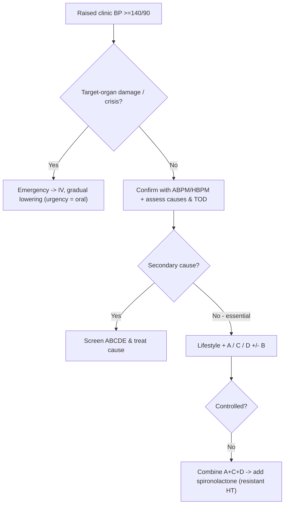

# Hypertension

Hypertension (HT) is a chronic elevation of blood pressure (office BP ≥140/90 mmHg) that is a progressive cardiovascular syndrome driving target-organ damage. It is usually asymptomatic ("silent killer") and is the single leading modifiable risk factor for death worldwide.

## Key Concepts

### Definition & measurement
- **Office HT** ≥140/90 mmHg (confirmed on repeated readings). Systolic and diastolic BP contribute independently — cardiovascular mortality **doubles for every 20/10 mmHg** rise above 115/75.
- **Isolated systolic hypertension (ISH)**: raised SBP with normal DBP — common in the elderly (arterial stiffening).
- **Out-of-office measurement** (home/ambulatory) correlates better with risk; home/ABPM thresholds are ~5–10 mmHg lower than office.
  - **White-coat HT**: high office, normal out-of-office (15–30%; lower risk but monitor).
  - **Masked HT**: normal office, high out-of-office (higher risk, easily missed).

### Aetiology
- **Primary/essential** (~90–95%): polygenic + environmental (salt, obesity, alcohol, inactivity). Younger patients tend to have higher renin/SNS drive; older patients volume/aldosterone.
- **Secondary** (search if onset <30 or >55, severe/resistant, abrupt, or with clues) — mnemonic **ABCDE**:
  - **A** — Accuracy (measurement), Apnoea (OSA).
  - **B** — Bruit (renal artery stenosis), Bad kidney (renal parenchymal disease, polycystic).
  - **C** — Catecholamines (phaeochromocytoma), Cushing, Coarctation.
  - **D** — Diet (salt/alcohol/obesity), Drugs (NSAIDs, COCP, steroids, sympathomimetics, EPO).
  - **E** — Endocrine (primary aldosteronism, thyroid, parathyroid).

### Evaluation of a new hypertensive
- Confirm sustained elevation; screen for **secondary causes**; establish baseline; assess other CV risk factors; detect **target-organ damage (TOD)**.
- **Basic tests**: urinalysis, U&E/creatinine (eGFR), K⁺/Ca²⁺, glucose/HbA1c, lipids, uric acid, **ECG** (LVH, ischaemia), TSH, ± CXR/echo.
- **Target-organ damage**: LVH & diastolic dysfunction (heart), proteinuria/↑creatinine (kidney), retinopathy (eye fundi), atheromatous plaque (large arteries), TIA/stroke (brain).

### Complications (relative risk vs normotensive)
- CKD ↑5–6×, heart failure ↑3×, coronary disease ↑3×, stroke ↑2×, LVH ↑2×. Diabetes + HT is especially damaging.

### Management
- **Goal**: reduce total CV risk (treat all risk factors, not just BP). Typical targets <140/90; <130/80 in diabetes/CKD if tolerated; relaxed (<150/90) in frail elderly. Lifelong treatment.
- **Lifestyle** (also useful preventively): weight loss (~1 mmHg per kg), salt restriction (10→5 g/day ≈ ↓5–6 mmHg), DASH diet, regular aerobic exercise, alcohol moderation, smoking cessation.
- **First-line drugs (A/C/D ± B)**:
  - **A** — ACEI or ARB (do not combine the two).
  - **C** — Calcium channel blocker.
  - **D** — thiazide/thiazide-like diuretic.
  - **B** — β-blocker (specific compelling indications, e.g. post-MI [[Acute Coronary Syndromes]], heart failure, AF rate control — see [[Syncope and Arrhythmia]]).
- **Combinations**: start dual therapy (often single-pill) for stage 2. Rational pairs act on complementary mechanisms: **A + C**, **A + D**, then **A + C + D**; add spironolactone for resistant HT.
- **Compelling indications** steer choice (e.g. ACEI/ARB in diabetes/CKD/heart failure; CCB or diuretic in older/ISH patients).
- **Monitor** for class-specific effects: ACEI/ARB — K⁺, creatinine (avoid in bilateral renal artery stenosis); diuretics — Na⁺/K⁺, urate/gout; CCB — ankle oedema; β-blocker — bradycardia, masking hypoglycaemia.

### Resistant hypertension
- BP above goal despite 3 drugs (incl. a diuretic) at adequate doses. First **exclude pseudo-resistance** (poor adherence, white-coat effect, wrong cuff/technique). Then optimise diuretic, add **aldosterone antagonist**, remove interfering agents (NSAIDs, salt), and re-screen for secondary causes.

### Hypertensive emergency vs urgency
- **Emergency** — severe BP **with acute target-organ damage** (encephalopathy, acute heart failure/pulmonary oedema, ACS, aortic dissection, eclampsia, AKI, papilloedema = malignant HT). Needs controlled **IV** BP reduction (usually MAP −20–25% over hours; faster/lower for aortic dissection — SBP <110–120 with β-blocker + vasodilator).
- **Urgency** — severe BP **without** acute organ damage; lower over 24–48 h with oral agents.
- Caution: do not rapidly lower BP in acute ischaemic stroke (loss of cerebral autoregulation).

## Approach

## Practice Questions

> [!question]- Q1: Distinguish white-coat from masked hypertension and their risk implications.
> **White-coat**: elevated office BP but normal home/ambulatory BP — lower risk than sustained HT but needs follow-up. **Masked**: normal office but elevated out-of-office BP — carries risk similar to sustained HT and is easily missed. Both need ambulatory/home monitoring to diagnose.

> [!question]- Q2: Give the ABCDE causes of secondary hypertension.
> **A** Accuracy/Apnoea (OSA), **B** Bruit (renal artery stenosis)/Bad kidney, **C** Catecholamines (phaeo)/Cushing/Coarctation, **D** Diet/Drugs, **E** Endocrine (aldosteronism, thyroid, parathyroid).

> [!question]- Q3: What features prompt a search for secondary hypertension?
> Onset <30 or >55 years, severe (≥180/110) or resistant HT, abrupt onset or loss of previous control, plus specific clues (hypokalaemia, renal bruit, absent femoral pulses, paroxysmal sweating/palpitations, Cushingoid features).

> [!question]- Q4: List the first-line antihypertensive classes and a rational combination.
> ACEI/ARB (A), CCB (C), thiazide-like diuretic (D), with β-blocker (B) for compelling indications. Rational combinations: A+C or A+D, escalating to A+C+D; add spironolactone for resistant HT. Never combine ACEI with ARB.

> [!question]- Q5: Define resistant hypertension and the first step in its assessment.
> BP above target despite three agents (including a diuretic) at optimal doses. First **exclude pseudo-resistance** — non-adherence, white-coat effect, and measurement error — before escalating therapy.

> [!question]- Q6: How does a hypertensive emergency differ from urgency, and how fast do you lower BP?
> **Emergency** = severe HT with acute target-organ damage → IV therapy, gradual reduction (MAP −20–25% over hours). **Urgency** = severe HT without acute damage → oral agents over 24–48 h. Exception: aortic dissection needs rapid SBP <110–120.

> [!question]- Q7: Which single-organ investigations detect hypertensive target-organ damage?
> ECG/echo for LVH; serum creatinine/eGFR and urinalysis for renal damage/proteinuria; fundoscopy for retinopathy; arterial ultrasound for atheroma.
