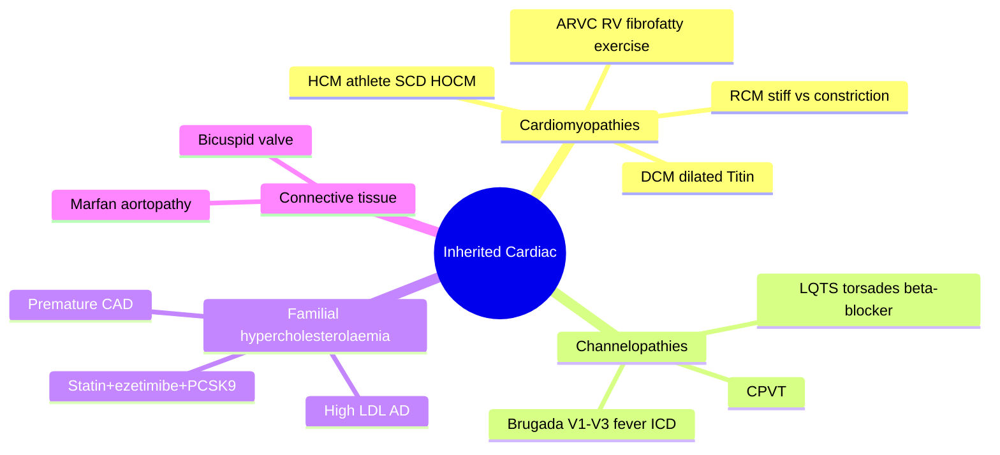

# Inherited Cardiac Conditions

Hereditary cardiac diseases are genetic (often autosomal dominant, with variable penetrance) disorders that predispose to heart failure and **sudden cardiac death (SCD)**, frequently in young, otherwise healthy people. Recognising them matters because SCD may be the first presentation, and family (cascade) screening can save relatives. They span **cardiomyopathies**, **channelopathies**, familial hypercholesterolaemia, and connective-tissue aortopathies.

## Key Concepts

### Overview
- **Inherited cardiomyopathies**: HCM, DCM, ARVC, RCM.
- **Inherited rhythm/conduction disorders (channelopathies)**: long QT (LQTS), Brugada (BrS), CPVT, progressive cardiac conduction disease.
- **Familial hypercholesterolaemia (FH)**.
- **Connective-tissue/aortopathy**: Marfan, Ehlers-Danlos, Loeys-Dietz, familial thoracic aortic aneurysm/dissection, bicuspid valve aortopathy (→ [[Sudden Severe Chest Pain and Aortic Dissection]]).
- *Cardiomyopathy vs heart failure*: cardiomyopathy is an **anatomic/pathological** diagnosis; [[Heart Failure]] is a **clinical syndrome**. One can cause the other but not always.

### Cardiomyopathies (morphological classes)
- **Dilated (DCM)**: dilated LV + reduced LVEF, not explained by CAD/valve/HT. ~60% of all cardiomyopathies; ~50% of idiopathic DCM is familial (mostly AD; commonest gene **Titin ~20–25%**, Lamin A/C). Causes also include infection (coxsackie/viral myocarditis), toxins/alcohol, peripartum, infiltrative, autoimmune, neuromuscular (Duchenne/Becker). → progressive HF, arrhythmia, SCD.
- **Hypertrophic (HCM)**: LV wall thickness ≥15 mm (or ≥13 with FHx/genetics) unexplained by loading. 1:500; **leading cause of SCD in young athletes**; AD sarcomere mutations. **HOCM** = obstructive variant (asymmetric septal hypertrophy + systolic anterior motion of mitral leaflet → LVOT obstruction, diastolic dysfunction, ischaemia, MR). Presents with exertional dyspnoea, angina, syncope. **Avoid vasodilators**; negative inotropes worsen obstruction less — treat with β-blocker, non-DHP CCB, disopyramide, septal myectomy/ablation; ICD if high SCD risk.
- **Arrhythmogenic RV cardiomyopathy (ARVC)**: fibrofatty replacement of RV; AD, variable penetrance; **exercise accelerates disease**. VT with **LBBB morphology**, epsilon waves and T-wave inversion V1–V3 on ECG. Manage arrhythmias (ICD/β-blockers), restrict endurance exercise.
- **Restrictive (RCM)**: ↑myocardial stiffness → impaired filling/diastolic dysfunction ("restrictive physiology"); least common; mostly acquired/secondary (amyloid, sarcoid, Fabry, haemochromatosis). Must be **distinguished from constrictive pericarditis** (surgically treatable). Some have specific therapy (tafamidis for ATTR amyloid, enzyme replacement for Fabry).

### Channelopathies
- **Long QT syndrome (LQTS)**: prolonged QT (corrected, Bazett QTc = QT/√RR) + risk of polymorphic VT / **torsades de pointes**. Presents with syncope, seizures, SCD. Congenital (ion-channel genes, reduced repolarising I_Ks/I_Kr or enhanced I_Na) or **acquired** (hypokalaemia/hypomagnesaemia/hypocalcaemia, bradycardia, and many **QT-prolonging drugs** — class IA/III antiarrhythmics, macrolides/quinolones, antipsychotics, TCAs, antifungals). Diagnosis: symptoms + ECG + **Schwartz score**, provocative testing, exclude reversible causes, genetics. **Treat with β-blockers** (prevent ~70% of events), avoid QT-prolonging drugs, correct electrolytes; ICD if prior arrest or symptomatic despite β-blocker; left cardiac sympathetic denervation/pacing in selected cases.
- **Brugada syndrome (BrS)**: coved **ST elevation in V1–V3 (type 1 = diagnostic)** in a structurally normal heart, with risk of VF, typically **at rest/night or during fever**. SCN5A loss-of-function (↓I_Na), AD. Arrhythmias unmasked by fever/Na-channel blockers. Manage: ICD if symptomatic (syncope/arrest); treat fever, avoid aggravating drugs/alcohol/cocaine; quinidine or isoprenaline for storms; ablation for refractory VT. (See channelopathy overlap in [[Syncope and Arrhythmia]].)

### Familial hypercholesterolaemia (FH)
- AD disorder of markedly elevated **LDL-C** (mutations in LDLR, APOB, PCSK9). Heterozygous ~1:200–1:500. Causes **premature atherosclerotic CAD** because of lifelong cumulative LDL exposure.
- Signs: tendon xanthomas, xanthelasma, corneal arcus (young). Diagnose on LDL-C thresholds + family history/genetics; use **cascade screening** of relatives.
- Treat aggressively: high-intensity **statin + ezetimibe ± PCSK9 inhibitor** (± bile-acid sequestrant); many still need combination to reach target. See [[Ischaemic Heart Disease and Angina Pectoris]].

## Mind Map

## Practice Questions

> [!question]- Q1: Why must vasodilators be avoided in obstructive HCM (HOCM)?
> Vasodilators reduce afterload and preload, which increases the dynamic left-ventricular outflow tract obstruction (worsening the pressure gradient and systolic anterior motion of the mitral valve), causing hypotension and syncope. Negative inotropes (β-blocker, non-DHP CCB, disopyramide) are used instead.

> [!question]- Q2: What is the diagnostic ECG pattern of Brugada syndrome and what unmasks it?
> **Type 1**: coved ST-segment elevation ≥2 mm in right precordial leads (V1–V3) with a negative T wave, in a structurally normal heart. It can be intermittent and is unmasked by **fever** or sodium-channel-blocker (ajmaline/flecainide) challenge.

> [!question]- Q3: First-line treatment of long QT syndrome and one class of drugs to avoid?
> **β-blockers** (prevent ~70% of events); ICD for those with prior arrest or symptoms despite β-blockade. Avoid QT-prolonging drugs (class IA/III antiarrhythmics, macrolides, antipsychotics, TCAs) and correct hypokalaemia/hypomagnesaemia.

> [!question]- Q4: How does ARVC characteristically present and why is exercise restricted?
> Ventricular arrhythmias of **LBBB morphology** and SCD in the young, with fibrofatty RV replacement (epsilon waves, T-wave inversion V1–V3). High-intensity endurance exercise promotes arrhythmias and disease progression, so it is avoided.

> [!question]- Q5: Which cardiomyopathy must be distinguished from constrictive pericarditis, and why does it matter?
> **Restrictive cardiomyopathy** — it mimics constriction clinically and haemodynamically, but constrictive pericarditis is **surgically treatable** (pericardiectomy), so the distinction (echo, cardiac MRI, right-heart catheterisation) changes management.

> [!question]- Q6: What underlies the premature coronary disease of familial hypercholesterolaemia, and how is it treated?
> Lifelong high LDL-C (autosomal dominant LDLR/APOB/PCSK9 mutations) → large cumulative LDL burden → early atherosclerosis. Treated aggressively with high-intensity statin + ezetimibe ± PCSK9 inhibitor, and cascade screening of relatives.

> [!question]- Q7: Name the commonest genetic cause of familial dilated cardiomyopathy.
> **Titin (TTN) truncating variants** (~20–25%), followed by Lamin A/C (LMNA); most familial DCM is autosomal dominant.
