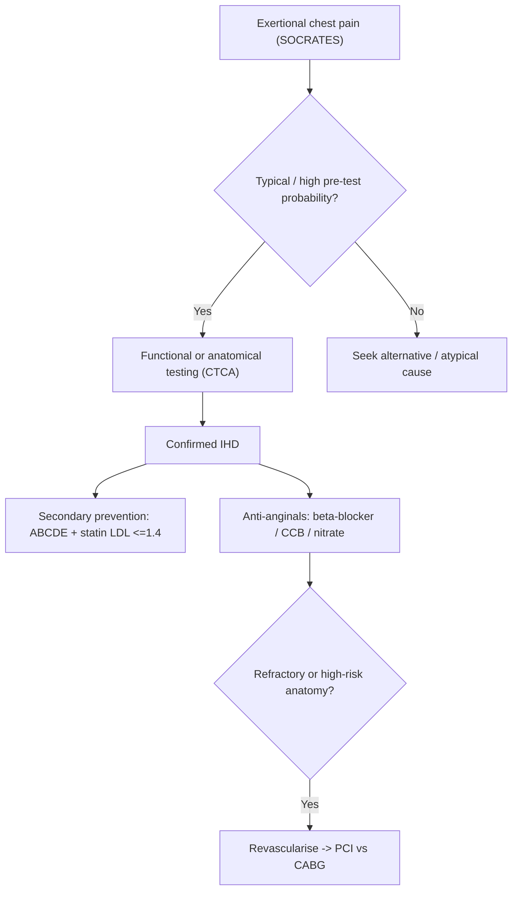

# Ischaemic Heart Disease and Angina Pectoris

Ischaemic heart disease (IHD) is myocardial ischaemia from an imbalance between coronary supply and myocardial oxygen demand, most often due to coronary **atherosclerosis**. **Stable angina** is reproducible exertional chest discomfort relieved by rest or nitrates; unstable presentations fall under [[Acute Coronary Syndromes]].

## Key Concepts

### Pathophysiology & Aetiology
- **Supply–demand mismatch**: fixed atheromatous stenosis limits flow reserve, so ischaemia appears when demand rises (exertion, tachycardia, cold, emotion, heavy meals — the "4 E's": Exertion, Emotion, Eating, Environment).
- **Atherosclerosis** is the dominant cause; cumulative LDL-C exposure ("LDL-years") drives plaque burden.
- **Non-atheromatous causes**: coronary spasm (Prinzmetal), arteritis, dissection, congenital anomalies, myocardial bridging; aortic stenosis and HOCM raise demand/reduce supply; non-cardiac — anaemia, hypoxaemia, hyperthyroidism, polycythaemia (hyperviscosity).
- Cardiac pain is referred via T1–T5 sympathetic afferents converging with somatic thoracic input → chest/arm/jaw referral. Diabetics may have **silent ischaemia** (autonomic neuropathy).

### History — characterising angina (SOCRATES)
- **Site**: retrosternal / left chest. **Radiation**: jaw, neck, left arm (ulnar), interscapular, epigastrium.
- **Character**: tightness, pressure, squeezing, heaviness ("band across chest") — *not* sharp/pleuritic.
- **Duration**: 2–10 min, gradual onset and offset. **Relief**: rest or GTN.
- **Typical angina** = all 3 of (1) constricting retrosternal discomfort, (2) provoked by exertion, (3) relieved by rest/GTN in ≤5 min. 2/3 = atypical; 0–1 = non-anginal.
- Anginal equivalents: exertional dyspnoea, fatigue, dizziness/syncope, epigastric burning (esp. women, elderly, diabetics).

### Examination
- Often **normal**. Look for **risk-factor signs**: xanthelasma, corneal arcus, tendon xanthomas (lipids); acanthosis nigricans (insulin resistance); tobacco stigmata; ear-lobe crease (Frank sign).
- Look for **complications** (heart failure — raised JVP, S3, displaced apex, basal crepitations; ischaemic MR) and **precipitants/mimics** (aortic stenosis murmur, thyroid enlargement, severe anaemia).

### Investigations
- **Bloods**: fasting lipids (LDL-C, HDL-C, TG), **Lp(a)** (genetic, risk if >50 mg/dL), fasting glucose/HbA1c, renal & thyroid function, FBC.
- **Resting ECG**: often normal in stable angina; may show old infarct/Q waves, LVH.
- **Assess pre-test probability** of CAD from age, sex, symptom typicality + risk factors, then choose testing.
- **Functional (ischaemia) tests**: exercise treadmill ECG (cheapest, sens 50–80%), stress echo, myocardial perfusion SPECT, stress cardiac MRI (best sens/spec ~90–95%).
- **Anatomical**: **CT coronary angiography** (good rule-out in low–intermediate risk); **invasive coronary angiography** for high-risk features, refractory angina, or diagnostic uncertainty. See [[Cardiovascular Investigations and ECG]].

### Management — "ABCDE"
- **A** — Antiplatelet ([[Antiplatelets and Anticoagulation]]: aspirin, clopidogrel if intolerant), Anti-anginal, ACEI/ARB, Angioplasty.
- **B** — Beta-blocker, Blood-pressure control ([[Hypertension]]), Bypass (CABG).
- **C** — Cholesterol lowering (high-intensity statin ± ezetimibe ± PCSK9i; LDL-C target ≤1.4 mmol/L in established CAD), Cigarette cessation, Calcium channel blockers.
- **D** — Diabetes control, Diet.
- **E** — Education, Exercise.

#### Anti-anginal (symptom) drugs
- **First line**: β-blockers (↓HR, contractility, BP) and/or **CCBs**. Non-dihydropyridines (verapamil, diltiazem) slow AV node — avoid combining with β-blocker (bradycardia/block); dihydropyridines (amlodipine, nifedipine) are pure vasodilators.
- **Nitrates**: short-acting GTN for acute relief/prophylaxis; long-acting for prevention (allow nitrate-free interval). Contraindicated with PDE-5 inhibitors and in HOCM; caution SBP <90.
- **Second line/novel**: ivabradine (I_f current, ↓HR), ranolazine (late Na current; prolongs QT), nicorandil (K_ATP opener), trimetazidine (metabolic).
- **Prognostic drugs** (reduce events): statins, aspirin, ACEI (esp. with HTN/DM/EF ≤40%/CKD).

#### Revascularisation
- **PCI** (stent) for symptom control / suitable anatomy.
- **CABG** preferred to improve survival in: left main stenosis, three-vessel disease, or two-vessel disease with proximal LAD involvement (esp. with LV dysfunction/diabetes).

### Special syndromes
- **Prinzmetal (variant) angina**: coronary spasm, rest pain (often early morning/after cold), transient **ST elevation**, risk of VT; treat with CCB ± nitrate.
- **Cardiac syndrome X / INOCA**: angina + ischaemia with non-obstructed coronaries (microvascular); treat with standard anti-anginals ± adjuncts.
- **Congenital coronary anomalies**: cause of exertional syncope/sudden death in young athletes; normal ECG/exam — diagnose on CT/MRI angiography.

## Approach

## Practice Questions

> [!question]- Q1: Define "typical angina" and how the number of features changes the classification.
> All three of: (1) constricting retrosternal discomfort, (2) provoked by exertion, (3) relieved by rest/GTN within ~5 min = **typical**. Two of three = **atypical**; none/one = **non-anginal** chest pain. This drives pre-test probability of CAD.

> [!question]- Q2: Why should verapamil/diltiazem not be routinely combined with a β-blocker?
> Both suppress the AV node and slow heart rate/contractility, risking severe bradycardia, AV block, and worsening heart failure. Dihydropyridine CCBs (amlodipine) are safer to combine with a β-blocker.

> [!question]- Q3: What LDL-C target applies in established coronary artery disease, and how is it reached?
> LDL-C ≤1.4 mmol/L (and ≥50% reduction), using high-intensity statin, adding ezetimibe and then a PCSK9 inhibitor if not at goal.

> [!question]- Q4: Which anatomical patterns favour CABG over PCI for survival benefit?
> Left main disease, three-vessel disease, and two-vessel disease involving the proximal LAD (especially with reduced LVEF or diabetes).

> [!question]- Q5: Describe Prinzmetal angina and its distinguishing ECG feature.
> Angina from coronary artery **spasm**, occurring at rest (often after cold/early morning), cyclical, with transient **ST-segment elevation** and risk of ventricular arrhythmia. Treated with calcium channel blockers ± nitrates; β-blockers may worsen it.

> [!question]- Q6: Name three physical signs of dyslipidaemia relevant to CAD risk.
> Xanthelasma, corneal arcus, and tendon/cutaneous xanthomas (acanthosis nigricans additionally flags insulin resistance).

> [!question]- Q7: Which stress test has the highest diagnostic sensitivity/specificity, and when is CT coronary angiography most useful?
> Stress cardiac MRI perfusion (and SPECT) reach ~90–95%. CT coronary angiography is best for **ruling out** disease in patients with low-to-intermediate pre-test probability.
