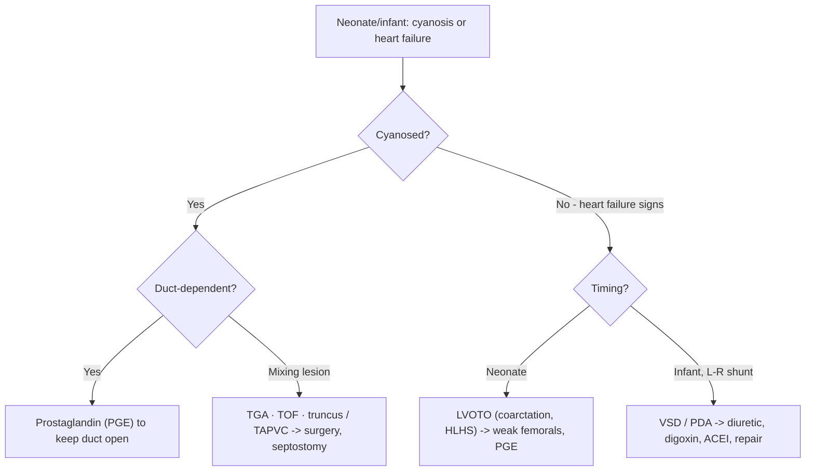

# Paediatric Congenital Heart Disease

Congenital heart disease presents in children in two big patterns: **heart failure** (usually from volume/pressure overload) and **cyanosis** (right-to-left shunting or abnormal mixing). Timing of presentation and the concept of a **duct-dependent circulation** are the keys to recognition and emergency management. Adult heart failure physiology is covered in [[Heart Failure]].

## Key Concepts

### Paediatric heart failure — concept
- The heart fails to pump enough to meet demand: **supply vs demand** and **pump dysfunction vs cardiac overload** (pressure or volume). In children, **overload from structural lesions** dominates (vs pump dysfunction in adults).
- **Symptoms**: breathlessness on exertion/feeding, **poor feeding, sweating, failure to thrive**, recurrent chest infections, exercise intolerance in older children.
- **Signs**: pulmonary congestion (tachypnoea, subcostal recession, wheeze), systemic congestion (hepatomegaly — peripheral oedema is rare), compensatory tachycardia/cardiomegaly, and low-output signs (cool peripheries, prolonged capillary refill, weak pulses) when decompensated.

### Causes by age
- **Neonates**: LV outflow tract obstruction (coarctation/interrupted arch, critical aortic stenosis, hypoplastic left heart), myocardial dysfunction (ischaemia, myocarditis, cardiomyopathy), arrhythmia (SVT, complete heart block), extra-cardiac (sepsis, asphyxia, hypocalcaemia, anaemia).
- **Infants**: large **left-to-right shunts** (VSD, AVSD, PDA) — symptoms appear later (weeks) as pulmonary vascular resistance falls, causing pulmonary overcirculation and LA/LV volume overload. **ASD** rarely causes infantile HF (volume-loads the right heart).
- **Older children**: myocardial disease (myocarditis, cardiomyopathy), unoperated or repaired/palliated structural defects.

### Duct-dependent circulation (critical concept)
- Some lesions rely on the **arterial duct** to supply either systemic or pulmonary flow. When the duct closes after birth, the neonate collapses.
- **Duct-dependent systemic** (e.g. severe LVOT obstruction) → weak/absent **femoral pulses**; **duct-dependent pulmonary** (e.g. pulmonary atresia) → severe cyanosis.
- **Emergency treatment: keep the duct open with prostaglandin E1/E2 (PGE1/E2)** for stabilisation before definitive surgery/catheter intervention. Femoral pulse examination is essential in any sick neonate.

### Cyanosis in the newborn
- **Central cyanosis** visible with ~3–5 g/dL reduced haemoglobin (confounded by anaemia/polycythaemia).
- **Cardiac vs respiratory**: the **hyperoxia test** — in cyanotic heart disease PaO₂ rises little on 100% O₂ (right-to-left shunt bypasses lungs), whereas lung disease shows a large rise.
- **Cardiac mechanisms**: right-to-left shunt, transposition physiology, reduced pulmonary flow (obstruction/atresia), or common mixing.

### Categories of cyanotic CHD
- **(I) Right-to-left shunt with RV outflow obstruction** — **Tetralogy of Fallot** (VSD, overriding aorta, RV outflow obstruction, RV hypertrophy): "boot-shaped" heart, oligaemic lungs, **hypercyanotic ("tet") spells**; correct at ~6–12 months. Pulmonary atresia with VSD or with intact septum is **duct-dependent pulmonary** — PGE + systemic-to-pulmonary shunt (modified **Blalock-Taussig**).
- **(II) Transposition of the great arteries** — parallel (not in-series) circulations; survival depends on **mixing** (duct, ASD). **Balloon atrial septostomy** for stabilisation; **arterial switch** operation in the early neonatal period is the anatomic correction of choice.
- **(III) Common mixing** — truncus arteriosus (mild cyanosis, HF as PVR falls), univentricular hearts (staged repair → **Fontan**), total anomalous pulmonary venous connection.
- **(IV) Ebstein anomaly** — apical displacement of the tricuspid valve.

### Management principles
- Identify and tackle the **cause and precipitants**; general supportive care.
- **Medical HF therapy**: diuretics, digoxin, ACEI, carvedilol.
- **Definitive**: surgical or catheter correction of the lesion; **PGE** for duct-dependent lesions; **balloon septostomy** for TGA; ECMO/ventricular assist device as a **bridge** to recovery or transplant.

## Approach

## Practice Questions

> [!question]- Q1: Why do large left-to-right shunts (VSD/PDA) cause heart failure weeks after birth rather than at birth?
> Pulmonary vascular resistance is high at birth and falls over the first weeks. As it falls, left-to-right shunting increases, causing pulmonary overcirculation and LA/LV volume overload — so symptoms emerge later than with obstructive neonatal lesions.

> [!question]- Q2: What is a duct-dependent circulation and how is it managed acutely?
> A lesion where systemic or pulmonary blood flow depends on a patent arterial duct; ductal closure causes collapse or profound cyanosis. Managed acutely by **keeping the duct open with prostaglandin E1/E2** until surgical/catheter correction.

> [!question]- Q3: Which examination finding is critical in a collapsed neonate and what does it suggest?
> **Femoral pulses** — weak/absent femorals suggest duct-dependent systemic circulation from left-heart obstruction (e.g. coarctation, critical aortic stenosis, hypoplastic left heart).

> [!question]- Q4: How does the hyperoxia test distinguish cardiac from respiratory cyanosis?
> On 100% oxygen, PaO₂ rises markedly in lung disease but only minimally in cyanotic heart disease, because a right-to-left shunt bypasses the lungs and cannot be corrected by raising alveolar oxygen.

> [!question]- Q5: Name the four features of Tetralogy of Fallot and its classic CXR appearance.
> VSD, overriding aorta, right ventricular outflow obstruction, and RV hypertrophy — with a **"boot-shaped" heart** and oligaemic lung fields; children get hypercyanotic "tet" spells.

> [!question]- Q6: Why is transposition of the great arteries incompatible with life without mixing, and how is it stabilised?
> The systemic and pulmonary circulations run in **parallel** rather than in series, so deoxygenated blood recirculates. Survival needs mixing via the duct or an atrial communication — stabilised by **balloon atrial septostomy** (and PGE), then corrected by the arterial switch operation.

> [!question]- Q7: List the medical therapies used for paediatric heart failure.
> Diuretics, digoxin, ACE inhibitors, and carvedilol — alongside treating the underlying cause and precipitating factors.
