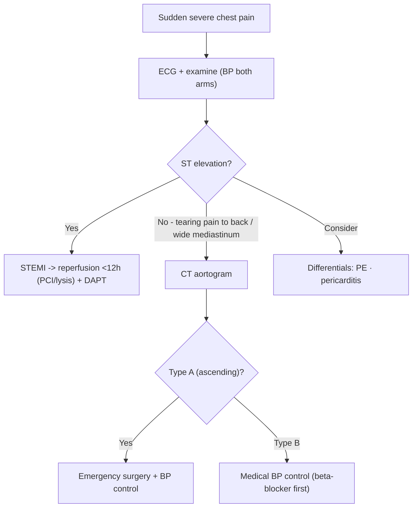

# Sudden Severe Chest Pain and Aortic Dissection

Sudden severe chest pain has two time-critical cardiac causes: **ST-elevation myocardial infarction (STEMI)** and **acute aortic dissection**. Both are emergencies where minutes matter — but their treatments are opposite (STEMI needs antithrombotics/reperfusion; dissection needs aggressive BP lowering and surgery), so distinguishing them is essential. STEMI sits within the [[Acute Coronary Syndromes]] spectrum.

## Key Concepts

### STEMI — pathophysiology
- Fully **occlusive** coronary thrombus (usually on a fissured plaque) → transmural (full-thickness) infarction.
- High early mortality (~40% in first 4 weeks; half of deaths within 2 hours, usually from **VF**). ~90% have total occlusion within 4 h of pain.
- **Evolving phase** (first 6–12 h): muscle salvageable if oxygen demand falls (↓HR, ↓BP) or supply restored (reperfusion). Infarcted muscle is acidotic with Ca²⁺ loss/K⁺ efflux → arrhythmia.
- **Convalescent phase**: prevent adverse **remodelling** (wall thinning/dilatation → aneurysm, VSD, HF).

### STEMI — clinical features
- Chest pain: severe, prolonged (>30 min), constricting/crushing, radiates to left arm (ulnar); with dyspnoea, sweating, nausea/vomiting (Bezold-Jarisch reflex), dizziness. Peak incidence 06:00–12:00.
- **Differentials**: pericarditis (sharp, pleuritic, radiates to trapezius ridge, relieved sitting forward), pulmonary embolism (haemoptysis, pleuritic), **aortic dissection** (tearing, radiates to back).

### STEMI — diagnosis
- **ECG** is the key acute test: **ST-segment elevation** in ≥2 contiguous leads (± pathological Q waves = necrosis; T-wave inversion = ischaemia). Anterior (V-leads), inferior (II, III, aVF), and right-sided leads (V4R) for RV infarct.
- **Biomarkers**: **troponin T/I** — most sensitive & specific, not normally present, long-lasting (good for late presentation, poor for re-infarction); myoglobin rises first but non-specific; CK-MB, older markers (SGOT, LDH) now superseded. See [[Cardiovascular Investigations and ECG]].
- **Echo**: regional wall-motion abnormality, LVEF, mechanical complications.
- **Universal definition of MI** — Type 1 (spontaneous, atherothrombotic), Type 2 (supply-demand mismatch), Type 3 (sudden death before biomarkers), Type 4 (PCI-related), Type 5 (CABG-related).

### STEMI — treatment (time = muscle)
- **General**: bed rest, oxygen (if hypoxic), morphine, CCU monitoring, defibrillator on standby.
- **Reperfusion if <12 h from pain onset**:
  - **Primary PCI** — preferred if available promptly.
  - **Fibrinolysis** — if PCI not timely and no contraindication; give with ST elevation in ≥2 contiguous leads, onset <12 h.
    - *Agents*: fibrin-specific tPA/derivatives (alteplase, tenecteplase — faster, less bleeding) or non-specific streptokinase.
    - *Success markers*: pain relief, ≥50% ST resolution at 90 min, early CK peak, R-wave preservation.
    - *Absolute contraindications*: any prior ICH, known cerebral vascular lesion/tumour, ischaemic stroke <3 months (except <3 h), **suspected aortic dissection**, active bleeding/diathesis, significant closed head/facial trauma <3 months.
- **Antithrombotics**: aspirin + P2Y12 inhibitor (DAPT) + anticoagulant (heparin/LMWH/fondaparinux/bivalirudin) — see [[Antiplatelets and Anticoagulation]].
- **Adjuncts / remodelling protection**: β-blocker (↓mortality; avoid IV if hypotensive/shock), **ACEI/ARB** (LVEF <40%, DM, HT, CKD), aldosterone antagonist (LVEF ≤40% + HF, if no hyperkalaemia/renal failure), high-intensity statin (LDL-C <1.4 mmol/L).
- **Complications**: heart failure, arrhythmias, VSD (anterior MI), papillary muscle dysfunction → MR (inferior MI), pericarditis, mural thrombus.

### Aortic dissection
- **Pathology**: medial degeneration (collagen/elastin) → intimal tear → blood tracks into media creating a **false lumen**, extending antegrade/retrograde.
- **Causes**: hypertension (~80%), connective-tissue disease (Marfan, Ehlers-Danlos, Loeys-Dietz), bicuspid aortic valve, trauma, familial aneurysm.
- **Classification (Stanford)**: **Type A** — ascending aorta involved (surgical emergency); **Type B** — not involving ascending aorta (usually medical).
- **Presentation**: sudden **"tearing/ripping"** pain, maximal at onset. Anterior chest (ascending) vs interscapular/back/abdomen (descending). Signs: pulse deficits, BP asymmetry, acute **aortic regurgitation** (→ CHF), tamponade (hypotension), ischaemic limbs, paraplegia, CVA, syncope. Abnormal CXR (widened mediastinum) in >80%.
- **Imaging**: **CT aortogram** is first-line (fast, ~100% sens/spec, identifies false lumen); TOE (bedside, rapid, good for ascending aorta); MRI (excellent but slow — for stable/chronic follow-up).
- **Management**: **rapid BP/heart-rate control** — target SBP 100–120 mmHg; β-blocker (labetalol) **first** then vasodilator (nitroprusside) to blunt dP/dt; treat tamponade by surgical drainage. **Type A → urgent surgery** (resection + graft); **Type B → medical** unless complicated (rupture, malperfusion, ongoing pain) → surgery/stent graft. Mortality ~1%/hour in first 48 h untreated. Links to [[Hypertension]] (hypertensive emergency).

## Approach

## Practice Questions

> [!question]- Q1: Why must aortic dissection be excluded before giving fibrinolysis for chest pain with ST changes?
> Thrombolysis in a patient with dissection is catastrophic — it promotes bleeding into the false lumen, tamponade, and rupture. Suspected aortic dissection is an **absolute contraindication** to fibrinolysis.

> [!question]- Q2: What is the reperfusion strategy and time window for STEMI?
> Restore flow in the infarct-related artery within 12 h of pain onset: **primary PCI** is preferred; **fibrinolysis** if PCI cannot be delivered promptly and there is no contraindication.

> [!question]- Q3: How does the pain of aortic dissection differ from that of STEMI and pericarditis?
> Dissection: sudden **tearing/ripping** pain, maximal at onset, radiating to the back/interscapular region. STEMI: crushing, builds up, radiates to the left arm/jaw. Pericarditis: sharp/pleuritic, radiates to the trapezius ridge, relieved by sitting forward.

> [!question]- Q4: Contrast Stanford Type A and Type B dissection management.
> **Type A** (ascending aorta) is a surgical emergency — resection and graft. **Type B** (not ascending) is managed medically with BP control unless complicated by rupture, malperfusion, or refractory pain, when surgery/stent-grafting is needed.

> [!question]- Q5: Why is a β-blocker given before a vasodilator in dissection?
> Vasodilators (e.g. nitroprusside) alone cause reflex tachycardia and increased **dP/dt** (aortic wall shear stress), which can extend the dissection. A β-blocker first controls heart rate and shear before adding a vasodilator to reach SBP 100–120 mmHg.

> [!question]- Q6: Which mechanical complications follow anterior versus inferior MI?
> Anterior MI → ventricular septal defect (septal rupture); inferior MI → papillary muscle dysfunction/rupture causing acute mitral regurgitation. Both can also cause free-wall rupture, arrhythmia, and heart failure.

> [!question]- Q7: What cardiac biomarker is preferred for diagnosing MI and why?
> **Troponin T or I** — not normally present, more sensitive and specific than CK-MB, and long-lasting (useful for delayed presentation). Its persistence makes it less reliable for detecting early re-infarction.
