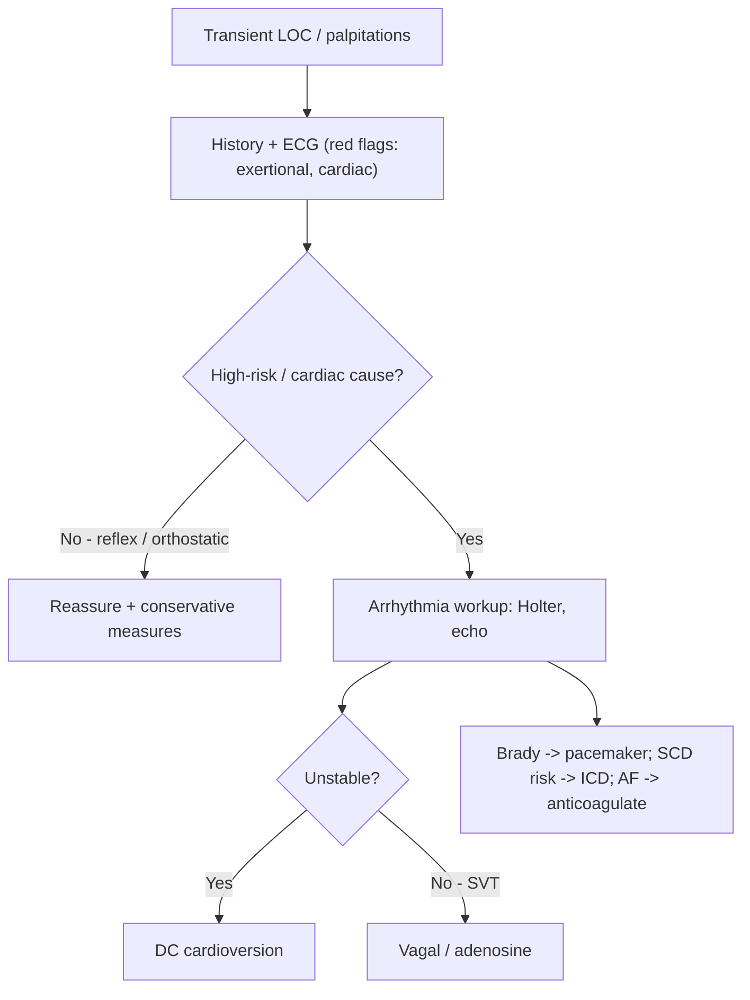

# Syncope and Arrhythmia

**Syncope** is transient loss of consciousness (TLOC) due to global cerebral hypoperfusion — rapid onset, brief, with spontaneous complete recovery. **Palpitation** is abnormal awareness of the heartbeat. Neither is a diagnosis: the goal is to identify the underlying cause (e.g. atrial fibrillation, complete heart block) and, critically, to separate benign reflex syncope from life-threatening **cardiac** causes.

## Key Concepts

### Palpitation — differentials
- **Cardiac**: arrhythmia, valvular disease, cardiomyopathy.
- **High-output states**: pregnancy, anaemia, fever, thyrotoxicosis.
- **Drugs/substances**: sympathomimetics, β-blocker withdrawal, caffeine, alcohol, cocaine, amphetamine.
- **Metabolic/psychiatric**: hypoglycaemia, phaeochromocytoma, panic/anxiety.
- *History clues*: abrupt onset/offset = SVT; gradual = sinus tachycardia; "missed beats" = ectopics; completely irregular = **AF**; terminated by vagal manoeuvres = SVT; polyuria after attack = SVT (↑ANP).

### Causes of syncope (and their risk)
- **Reflex/neurally-mediated** (~60%, low mortality): vasovagal (prolonged standing, pain, emotion, hot/crowded), carotid sinus syndrome, situational (cough, micturition).
- **Orthostatic hypotension** (~15%): drugs (diuretics, vasodilators), autonomic failure (diabetes, parkinsonism), volume depletion.
- **Cardiac** (~10%, **high mortality** — driven by underlying heart disease):
  - *Arrhythmic*: bradycardia (sinus arrest, AV block), tachycardia (VT, SVT), channelopathies (long QT, Brugada).
  - *Structural*: aortic stenosis, HOCM, pulmonary hypertension, PE, aortic dissection.
- ~10% unexplained.

### Distinguishing cardiac from benign
- **Red flags for cardiac syncope**: syncope **during exertion or supine**, sudden palpitation immediately preceding, structural/coronary heart disease, abnormal ECG, family history of sudden death <40 y.
- **Reflex**: long history of recurrent syncope from young age, triggered by standing/pain/heat, with autonomic prodrome (nausea, sweating, pallor).
- Initial evaluation (history + exam + ECG) reaches a diagnosis in 60–70%; **history is the main factor**.

### Syncope vs seizure
- Syncope: relatively sudden, brief (<1–2 min), rapid **complete** recovery, prodrome of autonomic activation; brief convulsive jerks/incontinence possible but no prolonged post-ictal state.
- Seizure: aura, prolonged tonic-clonic activity, tongue biting, cyanosis, post-ictal drowsiness, retrograde amnesia.

### Arrhythmia mechanisms
- **Bradyarrhythmia**: failure of impulse formation (sinus node disease — bradycardia, arrest, SA block) or propagation (AV conduction disease).
  - AV block: **1°** (PR prolongation), **2° Mobitz I** (Wenckebach — progressive PR then dropped beat), **2° Mobitz II** (intermittent dropped beats, higher risk), **3°** (complete AV dissociation).
- **Tachyarrhythmia**: abnormal automaticity, **triggered activity** (early afterdepolarisations → torsades in long QT; delayed afterdepolarisations → CPVT), and **re-entry** (most common — needs dissociated pathways, unidirectional block, slow conduction).
- **Narrow-complex** tachycardia: sinus, SVT (AVNRT, AVRT, atrial tachycardia), AF/flutter. **Wide-complex**: VT, or SVT/AF with aberrancy or accessory-pathway conduction (antidromic AVRT).

### Investigations
- ECG, echocardiogram (structural disease), bloods (FBC, K⁺, Mg²⁺, TSH/T4). See [[Cardiovascular Investigations and ECG]].
- **Symptom–rhythm correlation**: Holter (24 h), 7-day/event recorder, implantable loop recorder, exercise testing, **tilt-table test** (reflex syncope), electrophysiological study.

### Acute management
- **Vagal manoeuvres** (carotid sinus massage, Valsalva) and **adenosine/ATP** (transient AV nodal block; half-life <10 s; contraindicated in asthma) both slow/block the AV node — they **terminate** AVNRT/AVRT and **unmask** atrial activity in AF/flutter.
- **Haemodynamically unstable tachyarrhythmia → synchronised DC cardioversion** (defibrillation for VF/pulseless VT). Stable → vagal/pharmacological.
- **Bradyarrhythmia**: correct reversible causes; IV atropine/dopamine; temporary then permanent **pacemaker**.

### Long-term / definitive
- **SVT / atrial flutter**: **catheter ablation** is now first-line for recurrent symptomatic cases; AV-nodal blockers (β-blocker, non-DHP CCB) for rate.
- **AF**: rate control (β-blocker, non-DHP CCB — avoid in HFrEF; digoxin) vs rhythm control (class Ic/III antiarrhythmics, ablation); plus **anticoagulation** by CHA₂DS₂-VASc (anticoagulate if ≥2 in men, ≥3 in women) — see [[Antiplatelets and Anticoagulation]].
- **VT/VF**: correct reversible factors, antiarrhythmics (amiodarone), ablation, and **ICD** in high-risk patients (e.g. long QT with prior arrest).

### Case illustration
- F/18 with exertional palpitations, blackouts, then collapse during a half-marathon requiring AED shock; post-resuscitation ECG shows prolonged QTc (590 ms) → **long QT syndrome** — a channelopathy causing exertional cardiac syncope and sudden death, treated with β-blockers and ICD.

## Approach

## Practice Questions

> [!question]- Q1: Which features of a syncopal episode point to a dangerous cardiac cause?
> Syncope **during exertion or when supine**, preceded by sudden palpitations, in a patient with structural/coronary heart disease or an abnormal ECG, or with a family history of sudden death under 40. These mandate urgent cardiac evaluation.

> [!question]- Q2: How does adenosine help both diagnose and treat a regular narrow-complex tachycardia?
> It transiently blocks the AV node. If the AV node is part of the circuit (AVNRT/AVRT) it **terminates** the tachycardia; if not (atrial tachycardia/flutter) it slows ventricular response and **unmasks** the atrial activity, revealing the diagnosis. Contraindicated in asthma.

> [!question]- Q3: Differentiate Mobitz I from Mobitz II second-degree AV block.
> **Mobitz I (Wenckebach)**: progressive PR prolongation until a beat is dropped — usually benign, at the AV node. **Mobitz II**: constant PR with sudden intermittent non-conducted beats — infra-nodal, higher risk of progressing to complete heart block, often needs pacing.

> [!question]- Q4: A haemodynamically unstable patient has a broad-complex tachycardia. What is the immediate treatment?
> Synchronised DC cardioversion (immediate defibrillation if pulseless VT/VF). Do not delay for drugs when the patient is unstable.

> [!question]- Q5: What determines the need for anticoagulation in atrial fibrillation?
> The **CHA₂DS₂-VASc** score (Congestive HF, Hypertension, Age ≥75 [2], Diabetes, prior Stroke/TIA [2], Vascular disease, Age 65–74, Sex female). Anticoagulate if ≥2 in men or ≥3 in women.

> [!question]- Q6: An 18-year-old collapses during exercise; post-arrest ECG shows QTc 590 ms. Diagnosis and mechanism?
> **Long QT syndrome** — a channelopathy causing early afterdepolarisation–triggered torsades de pointes, presenting as exertional syncope/sudden cardiac death. Managed with β-blockers, avoidance of QT-prolonging drugs, and an ICD in high-risk patients.

> [!question]- Q7: List three broad mechanisms of tachyarrhythmia.
> Enhanced/abnormal automaticity, triggered activity (early and delayed afterdepolarisations), and **re-entry** (the commonest), which requires two pathways, unidirectional block, and a zone of slow conduction.
